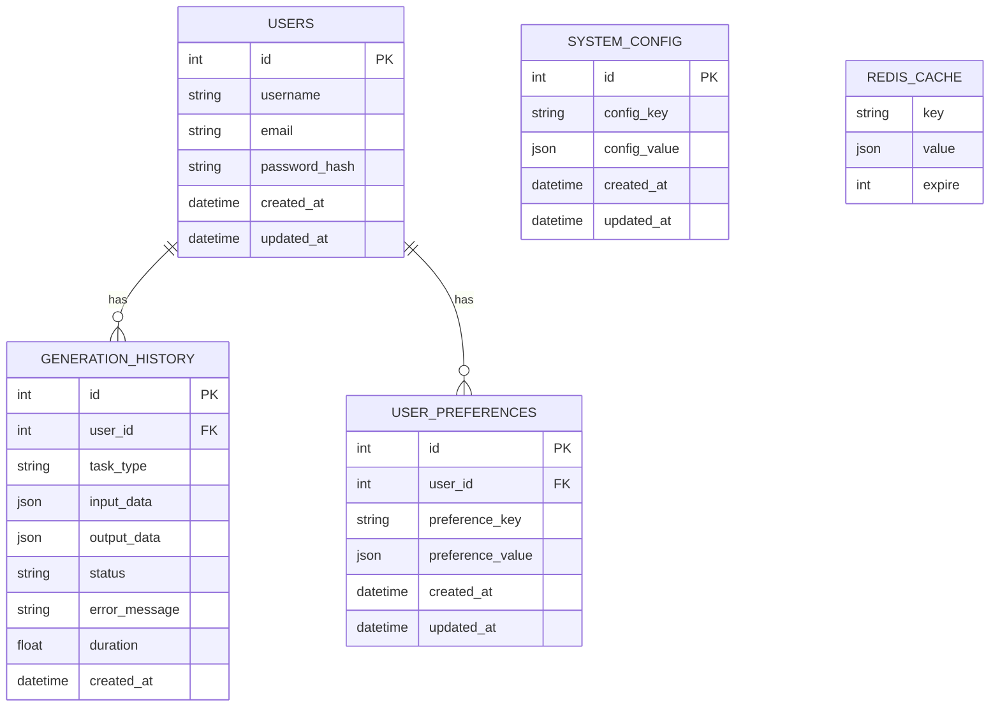

# 跨模态内容生成系统数据库ER图

## 实体关系图

## 表结构说明

### 1. users表
- **id**: 用户ID，主键
- **username**: 用户名
- **email**: 邮箱
- **password_hash**: 密码哈希值
- **created_at**: 创建时间
- **updated_at**: 更新时间

### 2. generation_history表
- **id**: 历史记录ID，主键
- **user_id**: 用户ID，外键，关联users表
- **task_type**: 任务类型（如text_to_image、image_to_text等）
- **input_data**: 输入数据，JSON格式
- **output_data**: 输出数据，JSON格式
- **status**: 状态（success或failed）
- **error_message**: 错误信息（可选）
- **duration**: 执行时长（秒）
- **created_at**: 创建时间

### 3. user_preferences表
- **id**: 偏好设置ID，主键
- **user_id**: 用户ID，外键，关联users表
- **preference_key**: 偏好键
- **preference_value**: 偏好值，JSON格式
- **created_at**: 创建时间
- **updated_at**: 更新时间

### 4. system_config表
- **id**: 配置ID，主键
- **config_key**: 配置键
- **config_value**: 配置值，JSON格式
- **created_at**: 创建时间
- **updated_at**: 更新时间

### 5. Redis缓存
- **key**: 缓存键
- **value**: 缓存值，JSON格式
- **expire**: 过期时间（秒）

## 关系说明

1. **用户与生成历史**：一对多关系，一个用户可以有多个生成历史记录
2. **用户与偏好设置**：一对多关系，一个用户可以有多个偏好设置
3. **系统配置**：独立表，存储系统级别的配置信息
4. **Redis缓存**：用于提高系统性能，存储临时数据

## 数据库设计特点

1. **JSON存储**：使用JSON格式存储复杂数据，提高灵活性
2. **外键关联**：通过外键建立表之间的关系，保证数据一致性
3. **时间戳**：所有表都包含创建时间和更新时间字段
4. **Redis缓存**：用于缓存频繁访问的数据，提高系统响应速度

此数据库设计支持系统的用户管理、生成历史记录、用户偏好设置和系统配置等功能，为跨模态内容生成系统提供了可靠的数据存储和管理基础。