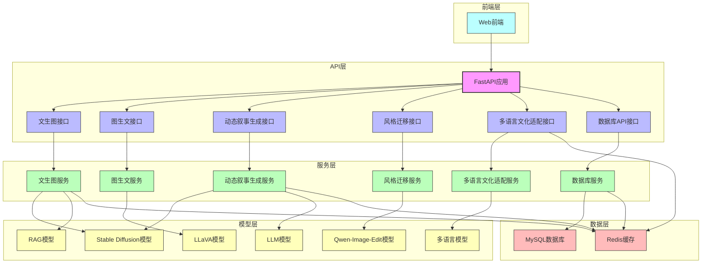

# 跨模态内容生成系统核心功能模块图

## 功能模块关系图

## 核心功能模块说明

| 功能模块 | 描述 | 技术实现 | 核心流程 |
|---------|------|---------|----------|
| **文生图** | 根据文本描述生成图像 | Stable Diffusion模型 + RAG模型 | 接收文本输入 → 提示词增强 → 图像生成 → 返回结果 |
| **图生文** | 分析图像生成文本描述 | LLaVA模型 | 接收图像输入 → 图像分析 → 文本生成 → 返回结果 |
| **动态叙事生成** | 根据关键词生成包含图像的故事 | LLM模型 + Stable Diffusion模型 | 接收关键词 → 生成故事场景 → 为每个场景生成图像 → 生成连贯故事 → 返回结果 |
| **风格迁移** | 将图像转换为指定风格 | Qwen-Image-Edit模型 | 接收图像和风格指令 → 风格转换 → 返回结果 |
| **多语言文化适配** | 将内容适配到不同语言和文化背景 | 多语言模型 | 接收内容和目标语言 → 文化适配 → 返回结果 |
| **数据库操作** | 管理用户、生成历史和系统配置 | MySQL数据库 | 数据存储、查询、更新和删除 |
| **缓存管理** | 提高系统性能 | Redis缓存 | 缓存频繁访问的数据，减少数据库负载 |

## 技术架构特点

| 特点 | 说明 | 优势 |
|------|------|------|
| **分层架构** | 清晰的API层、服务层、模型层和数据层 | 提高代码可维护性，便于功能扩展 |
| **模块化设计** | 每个功能模块独立封装 | 降低模块间耦合，便于单独测试和部署 |
| **多模型集成** | 整合多种先进的深度学习模型 | 实现多样化的跨模态内容生成功能 |
| **缓存机制** | 使用Redis缓存频繁访问的数据 | 提高系统响应速度，减少数据库负载 |
| **错误处理** | 完善的错误处理机制 | 确保系统在各种情况下都能稳定运行 |
| **可扩展性** | 模块化设计便于添加新功能 | 支持未来功能扩展和模型更新 |

## 数据流向

1. **用户请求**：前端发送请求到API接口
2. **请求处理**：API层接收请求并传递给相应的服务
3. **模型调用**：服务层调用相应的模型进行处理
4. **结果处理**：处理模型返回的结果
5. **数据存储**：将生成历史和相关数据存储到数据库
6. **缓存更新**：更新Redis缓存以提高后续请求的响应速度
7. **结果返回**：将处理结果返回给前端

此功能模块图展示了跨模态内容生成系统的整体架构和核心功能，清晰地反映了各模块之间的关系和数据流向，为系统的理解和维护提供了直观的参考。